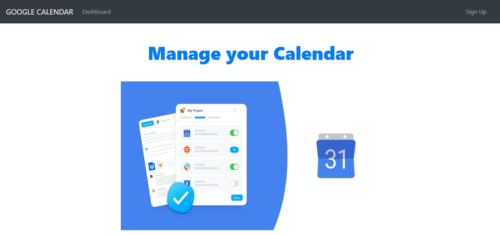
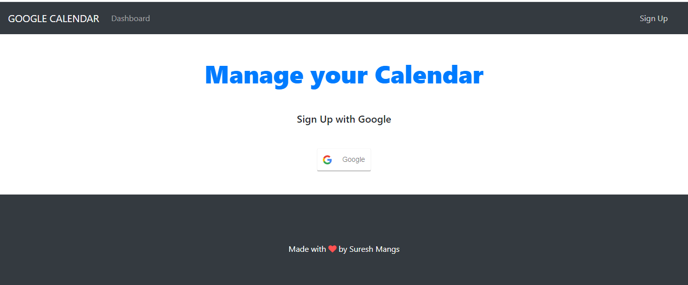
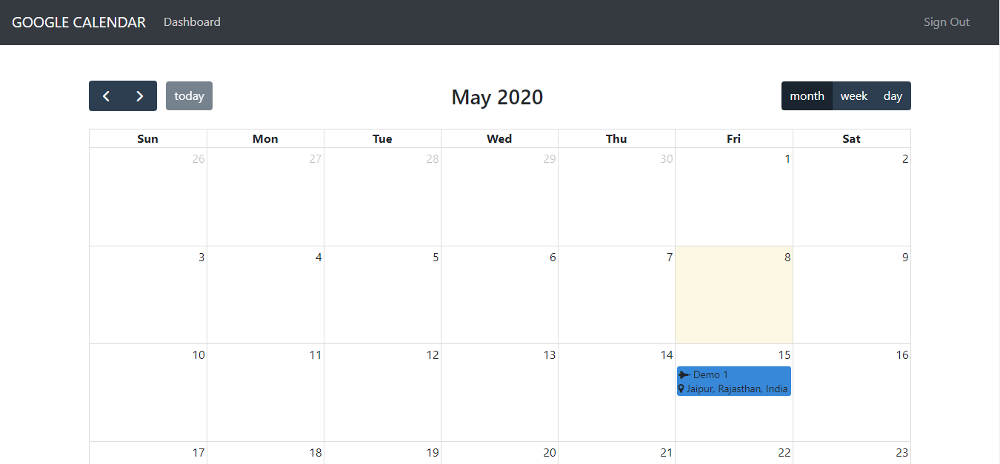

# :date: Manage Google Calendar

Building a MERN stack application to manage users Google Calendar

Link to application: [Google Calendar](https://manage-google-calendar.herokuapp.com/)

## :arrow_right: Technologies Used:

:one: MongoDB

:two: Express

:three: React + Redux

:four: Node

## :arrow_right: Get Started

Clone the repository

`git clone https://github.com/sureshmangs/google-calander.git`

In the project directory(goole-calander)

`npm install`

In the root directory, inside the .env file, set the following fields
```
module.exports = {
    JWT_SECRET: "XXXXXXXXXXXXXXXXXXX",
    CLIENT_ID: "XXXXXXXXXXXXXXXXXXXXXXXXXXXXXXXXXXXXXXXXXXXXXXXXXXXXXXXXXXXXXXXXXXXXXXXXXXXXXXXXXXXX",
    CLIENT_SECRET: "XXXXXXXXXXXXXXXXXXXXXXX",
    MONGODB_URI: "XXXXXXXXXXXXXXXXXXXXXXXXXXXXXXXXXXXXXXXXXXXXXXXXXXXXXXXXXXXXXXXXXXXXXXXXXXXXXXXXXXXXXXXXXXXXXX"
}
```

In the client directory, inside the ./src/config/keys.js file, set the following fields
```
module.exports = {
    CLIENT_ID: "XXXXXXXXXXXXXXXXXXXXXXXXXXXXXXXXXXXXXXXXXXXXXXXXXXXXXXXXXXXXXXXXXXXXXXXXXXXXXXXXXXXX",
}
```

In the client directory

`npm install`


To run the application, in the root dirctory

`npm run start-dev`

## :arrow_right: Demo







